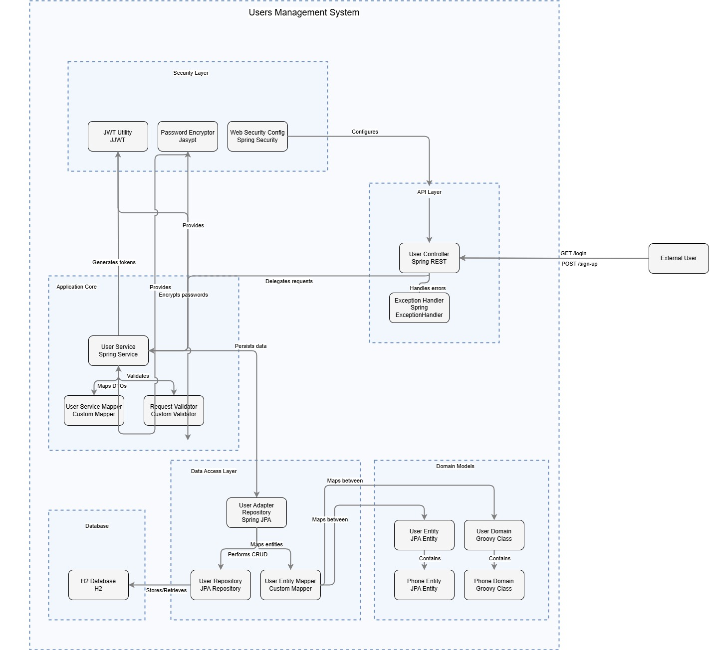
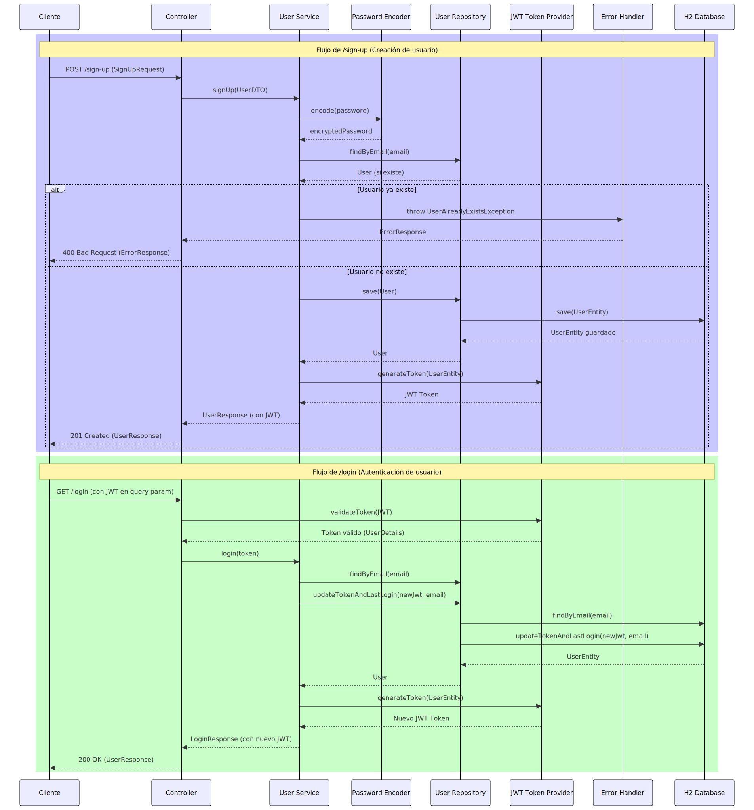

# Microservicio de Gestión de Usuarios

Este proyecto es un microservicio desarrollado en **Spring Boot** que permite la creación y consulta de usuarios. El microservicio sigue una **arquitectura hexagonal** y utiliza **Gradle** como herramienta de construcción. Además, cumple con los requisitos especificados en la prueba, incluyendo la validación de datos, persistencia en base de datos H2, generación de tokens JWT y pruebas unitarias.

---

## Tabla de Contenidos

1. [Requisitos](#requisitos)
2. [Instalación](#instalación)
3. [Configuración](#configuración)
4. [Ejecución](#ejecución)
5. [Endpoints](#endpoints)
6. [Pruebas Unitarias](#pruebas-unitarias)
7. [Diagramas UML](#diagramas-uml)
8. [Tecnologías Utilizadas](#tecnologías-utilizadas)
9. [Estructura del Proyecto](#estructura-del-proyecto)
10. [Contribución](#contribución)
11. [Licencia](#licencia)

---

## Requisitos

- **Java 8 u 11**: El proyecto está desarrollado utilizando Java 11.
- **Gradle 7.4**: Se utiliza Gradle como herramienta de construcción.
- **Spring Boot 2.5.14**: El proyecto está basado en Spring Boot.
- **Base de datos H2**: Se utiliza H2 como base de datos en memoria.
- **JWT**: Para la autenticación y generación de tokens.
- **Spock Framework**: Para pruebas unitarias con una cobertura mínima del 80%.

---

## Instalación

Sigue estos pasos para instalar y configurar el proyecto en tu entorno local:

1. Clona el repositorio:
   ```bash
   git clone https://github.com/jrcastb/_users.git
   
2. Navega al directorio del proyecto:

    ```bash
        cd _users
    ```
3. Construye el proyecto con Gradle:
    ```bash
        ./gradlew build

## Configuración
El proyecto utiliza un archivo application.properties para la configuración. Asegúrate de configurar los siguientes parámetros:

* Base de datos H2: La base de datos está configurada para funcionar en memoria. No se requiere configuración adicional.

  * JWT: Configura la clave secreta y el tiempo de expiración del token en application.properties.

      ```properties
          spring.application.name=_users
           jwt.secret=SecretBCIkeyForJWToken1
           jwt.expiration=21600
         
         
           server.port=8080
           spring.datasource.url=jdbc:h2:mem:testdb
           spring.datasource.driverClassName=org.h2.Driver
           spring.datasource.username=user
           spring.datasource.password=user
           spring.jpa.database-platform=org.hibernate.dialect.H2Dialect
           spring.h2.console.enabled=true
      ```

## Ejecución
Para ejecutar el proyecto, sigue estos pasos:

1. Ejecuta el proyecto con Gradle:
    ```bash
        ./gradlew bootRun
    ```
2. El microservicio estará disponible en:

   ```bash
        http://localhost:8080

## Endpoints
El microservicio expone los siguientes endpoints:

1. Registro de Usuario (POST /sign-up)
   Descripción: Crea un nuevo usuario.

**Request Body**:
    
```json
    {
        "name": "Julio Gonzalez",
        "email": "julio@testssw.cl",
        "password": "a2asfGfdfdf4",
        "phones": [
            {
                "number": 31167893467,
                "citycode": 7,
                "contrycode": "+25"
            }
        ]
    }
```
**Respuesta Exitosa**:

```json
    {
        "id": "e5c6cf84-8860-4c00-91cd-22d3be28904e",
        "created": "Nov 16, 2021 12:51:43 PM",
        "lastLogin": "Nov 16, 2021 12:51:43 PM",
        "token": "eyJhbGciOiJIUzI1NiJ9...",
        "isActive": true
    }
```
2. Login de Usuario (POST /login)
   Descripción: Autentica a un usuario y retorna su información.

**Request Body**:

```json
    {
        "email": "julio@testssw.cl",
        "password": "a2asfGfdfdf4"
    }
```
**Respuesta Exitosa:**

```json
      {
        "id": "e5c6cf84-8860-4c00-91cd-22d3be28904e",
        "created": "Nov 16, 2021 12:51:43 PM",
        "lastLogin": "Nov 16, 2021 12:51:43 PM",
        "token": "eyJhbGciOiJIUzI1NiJ9...",
        "isActive": true,
        "name": "Julio Gonzalez",
        "email": "julio@testssw.cl",
        "phones": [
            {
                "number": 31167893467,
                "citycode": 7,
                "contrycode": "+57"
            }
        ]
      }
```

## Pruebas Unitarias
El proyecto incluye pruebas unitarias con Spock Framework (o JUnit) que cubren más del 80% del código. Para ejecutar las pruebas, usa el siguiente comando:

```bash
    ./gradlew test
```

## Diagramas UML
El proyecto incluye los siguientes diagramas UML:

1. Diagrama de Componentes: Muestra la estructura del microservicio y las interacciones entre sus componentes.

   
   

2. Diagrama de Secuencia: Ilustra el flujo de las operaciones principales, como el registro y el login de usuarios.

   
   

Los diagramas se encuentran en la carpeta /diagrams.

## Tecnologías Utilizadas
* Java 11: Lenguaje de programación principal.

* Spring Boot 2.5.14: Framework para el desarrollo del microservicio.

* Gradle 7.4: Herramienta de construcción.

* H2 Database: Base de datos en memoria.

* JWT (JSON Web Tokens): Para autenticación.

* JUnit Framework: Para pruebas unitarias.

## Estructura del Proyecto
El proyecto sigue una arquitectura hexagonal y está organizado de la siguiente manera:
```
    src/
    ├── main/
    │   ├── java/
    │   │   ├── com.example.demo/
    │   │   │   ├── domain/          # Lógica de negocio y entidades
    │   │   │   ├── application/     # Casos de uso y DTOs
    │   │   │   ├── infrastructure/  # Adaptadores (persistencia, web, seguridad)
    │   │   │   └── configuration/   # Configuraciones globales
    │   └── resources/               # Archivos de configuración y propiedades
    └── test/                        # Pruebas unitarias
```
## Contribución
Si deseas contribuir a este proyecto, sigue estos pasos:

1. Haz un fork del repositorio.

2. Crea una rama para tu contribución (git checkout -b feature/nueva-funcionalidad).

3. Realiza tus cambios y haz commit (git commit -m 'Añade nueva funcionalidad').

4. Haz push a la rama (git push origin feature/nueva-funcionalidad).

5. Abre un Pull Request.

## Licencia
Este proyecto está bajo la licencia MIT. Para más detalles, consulta el archivo LICENSE.


